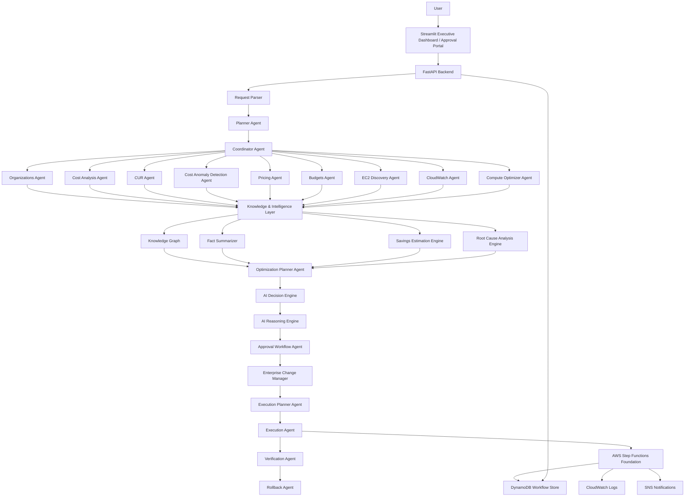
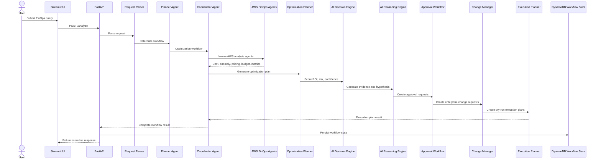
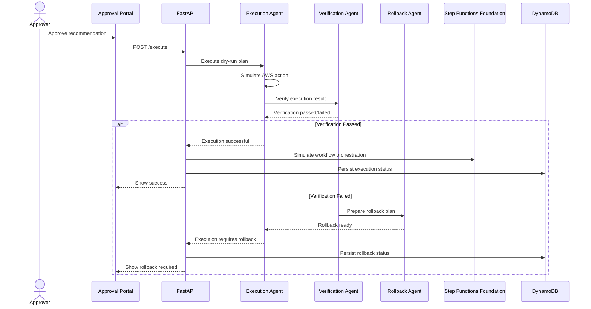
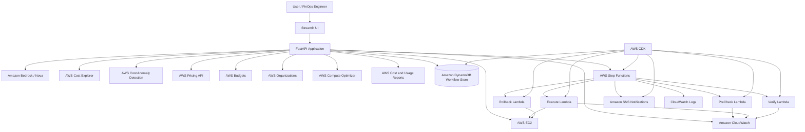
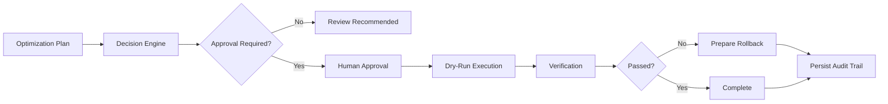

# Enterprise AI FinOps Platform Architecture

## 1. High-Level Architecture

---

## 2. Multi-Agent Workflow Sequence

---

## 3. Approval and Execution Flow

---

## 4. AWS Deployment Architecture

---

## 5. Runtime Safety Model

---

## 6. Current Platform Layers

| Layer | Components |
|---|---|
| User Interface | Streamlit Executive Dashboard, Approval Portal |
| API Layer | FastAPI |
| Planning Layer | Request Parser, Planner Agent, Coordinator Agent |
| AWS Data Layer | Cost Explorer, Anomaly Detection, Pricing, Budgets, EC2, CloudWatch, Compute Optimizer, CUR, Organizations |
| Intelligence Layer | Knowledge Graph, Fact Summarizer, Savings Estimation, Root Cause Analysis |
| Decision Layer | Optimization Planner, AI Decision Engine, AI Reasoning Engine |
| Governance Layer | Approval Workflow Agent, Enterprise Change Manager |
| Execution Layer | Execution Planner, Execution Agent, Verification Agent, Rollback Agent |
| Persistence Layer | DynamoDB Workflow Store |
| Orchestration Layer | Step Functions Foundation, CDK |
